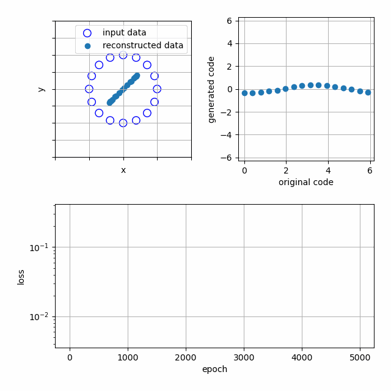

# Autoencoder

The gradient-based learning algorithm of the autoencoder.

## Problem formulation

The minimalization of the function that penalises a difference between input and reconstructed data and an increase of parameters' norm

$$\min_{\theta, \phi} \frac{1}{2} \left( \mathbb{E}_{x \sim D} \left[\|x - g_{\phi}(f_{\theta}(x))\|^{2}_{2} \right] + \alpha \left( \|\theta\|^{2}_{2} + \|\phi\|^{2}_{2} \right) \right)$$

where $f$ is the encoding function, $g$ is the decoding function, $\theta$ are encoder parameters, $\phi$ are decoder parameters, $D$ is the dataset and $\alpha$ - the regularization weight.

## Optimization algorithm

The optimization of the objective function through the gradient descent with momentum:

$\theta \leftarrow \theta_{initial}$

$\phi \leftarrow \phi_{initial}$

$v_{\theta} \leftarrow 0$

$v_{\phi} \leftarrow 0$

while $\theta$ and $\phi$ are not converged:

&emsp; $v_{\theta} \leftarrow \mu v_{\theta} - \epsilon \frac{\partial L}{\partial \theta}(\theta, \phi)$

&emsp; $\theta \leftarrow \theta + v_{\theta}$

&emsp; $v_{\phi} \leftarrow \mu v_{\phi} - \epsilon \frac{\partial L}{\partial \phi}(\theta, \phi)$

&emsp; $\phi \leftarrow \phi + v_{\phi}$

where $v_{\theta}$ is the $\theta$'s moment vector, $v_{\phi}$ is the $\phi$'s moment vector, $\mu$ is the step size, $\epsilon$ is the exponential decay rate and $L$ - the optimized loss function.

## Demonstration

The training of the autoencoder on two-dimensional data (points on the unit circle) and a one-dimensional latent representation.

## References

[I. Goodfellow and Y. Bengio and A. Courville, *Deep Learning*, MIT Press, 2016](https://www.deeplearningbook.org/)

[X. Glorot, Y. Bengio, "Understanding the difficulty of training deep feedforward neural networks", in Proc. 13th Int. Conf. Artificial Intelligence and Statistics, PMLR 9:249-256, 2010](https://proceedings.mlr.press/v9/glorot10a/glorot10a.html)

[I. Sutskever, J. Martens, G. Dahl, G. Hinton, "On the importance of initialization and momentum in deep learning", in Proc. 30th Int. Conf. Machine Learning, PMLR 28(3):1139-1147, 2013](https://proceedings.mlr.press/v28/sutskever13.html)