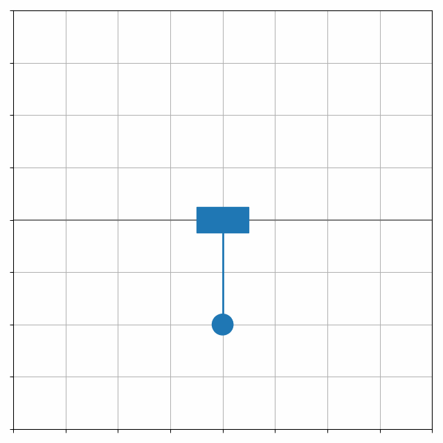

# Model predictive control

The model predictive controller of the cart-pole system described by the system of differential equations

$$(m_{c} + m_{p})\ddot{x} + m_{p}l\ddot{\theta}\cos{\theta} - m_{p}l\dot{\theta}^2\sin{\theta} = u$$

$$m_{p}l\ddot{x}\cos{\theta} + m_{p}l^2\ddot{\theta} + m_{p}gl\sin{\theta} = 0$$

where $m_{c}$ is the mass of the cart, $m_{p}$ is the mass of the pendulum, $x$ is the horizontal position of the cart, $\theta$ is the angle of the pendulum, $l$ is the length of the pendulum, $g$ is the gravitational acceleration, $u$ - the control horizontal force acting on the cart.

## Problem formulation

The minimalization of the function that penalises a difference between desired and measured system's state and a non-zero control signal

$$\min_{u_{1:T}} \frac{1}{2T} \left( \sum^{T}_{t=1} (\|r_{t} - y_{t}\|^{2}_{2}) + \gamma \sum^{T}_{t=1} (\|u_{t}\|^{2}_{2}) \right)$$

where $u_{t}$ is the control signal the time $t$, $r_{t}$ is the desired system's state at the time $t$, $y_{t}$ is the measured system's state at the time $t$, $\gamma$ is the control cost coefficient and $T$ - the size of the prediction horizon.

The control signal is optimized subject to the discrete approximation of controlled system's dynamics, system's initial conditions and control signal constraints.

## Optimization algorithm

The controller continuously optimizes/plans $T$ control signals into the future:

$u_{1:T} \leftarrow u_{initial, 1:T}$

$s \leftarrow 0$

while controller is running:

&emsp; $y_{1} \leftarrow \operatorname{measureState}()$

&emsp; while $u_{1:T}$ is not converged:

&emsp; &emsp; $g \leftarrow \frac{\partial L}{\partial u}(r_{1:T}, y_{1}, u_{1:T}u_{max})$

&emsp; &emsp; $s \leftarrow \beta s + (1 - \beta) g^{2}$

&emsp; &emsp; $u_{1:T} \leftarrow u_{1:T} - \frac{\alpha g}{\sqrt{s + \epsilon}}$

&emsp; &emsp; $u_{1:T} \leftarrow \operatorname{clip}(u_{1:T}, -1, 1)$

&emsp; $\operatorname{applyControlSignal}(u_{1}u_{max})$

&emsp; $u_{1:T - 1} \leftarrow u_{2:T}$

where $u_{max}$ is the maximal value of a control signal, $\alpha$ is the step size, $\beta$ is the exponential decay rate, $\epsilon$ is the small constant that prevents division by zero and $L$ - the optimized loss function.

## Demonstration

The stabilization of the cart-pole system in its unstable state.

## References

[R. Tedrake, *Underactuated Robotics: Algorithms for Walking, Running, Swimming, Flying, and Manipulation*. Course Notes for MIT 6.832, 2023](http://underactuated.mit.edu)

[RMSProp (famously unpublished)](https://www.cs.toronto.edu/~tijmen/csc321/slides/lecture_slides_lec6.pdf)